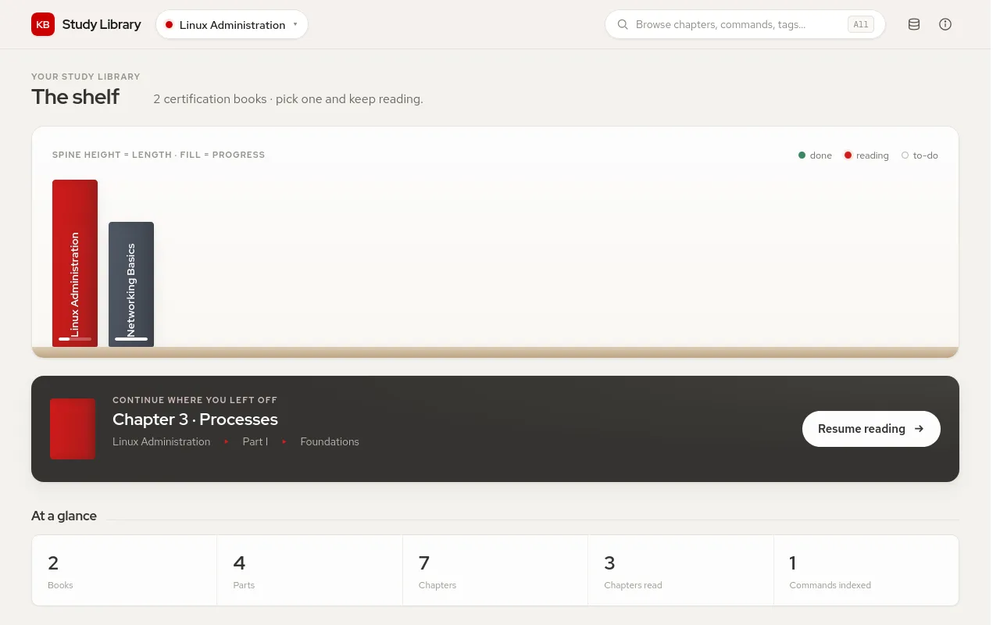
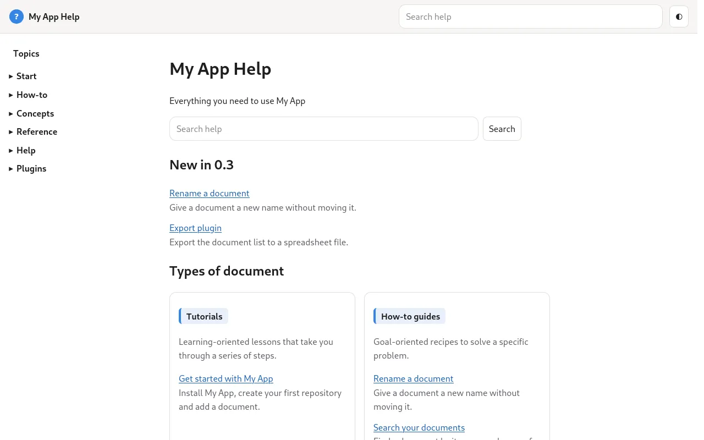

# Themes

A theme decides what the website looks like and which pages it has. Your documents stay the same: switch `"theme"` in `repo.json`, rebuild with `--force`, and the same files become a different site.

## The bundled themes {#bundled}

<div class="ah-cards">
  <section class="ah-card">
    <p><strong><a href="reference-theme-techdoc.html">techdoc</a></strong></p>
    <p>Team knowledge bases: runbooks, incidents, changes and meeting notes.</p>
    <p class="ah-muted">A dashboard with open items, an event calendar, monitoring, statistics and backups.</p>
    <p><a href="reference-theme-techdoc.html"></a></p>
  </section>
  <section class="ah-card">
    <p><strong><a href="reference-theme-blog.html">blog</a></strong></p>
    <p>A personal or team blog.</p>
    <p class="ah-muted">Posts with excerpts, an archive by date and a tag cloud.</p>
    <p><a href="reference-theme-blog.html"></a></p>
  </section>
  <section class="ah-card">
    <p><strong><a href="reference-theme-bookshelf.html">bookshelf</a></strong></p>
    <p>Study notes organised as books, parts and chapters.</p>
    <p class="ah-muted">A shelf with reading progress, book overviews and chapter navigation.</p>
    <p><a href="reference-theme-bookshelf.html"></a></p>
  </section>
  <section class="ah-card">
    <p><strong><a href="reference-theme-apphelp.html">apphelp</a></strong></p>
    <p>The help of an application, like this site.</p>
    <p class="ah-muted">Sections, a search that works offline and help ids for the application.</p>
    <p><a href="reference-theme-apphelp.html"></a></p>
  </section>
</div>

## Sample apps {#apps}

A theme can ship sample knowledge bases, called apps. `kb4it create` copies one to start you off:

```bash
kb4it apps techdoc                      # lists default and sapbasis
kb4it create techdoc sapbasis ~/sapkb   # starts from the sapbasis app
```

Without an app name you get `default`.

## Where themes come from {#lookup}

When you build, KB4IT looks for the theme named in `repo.json` in this order and uses the first it finds:

1. `source/resources/themes/<name>/` inside the knowledge base, so a site can carry its own theme.
2. `~/.kb4it/opt/resources/themes/<name>/`, for themes you install for yourself.
3. The themes that come with KB4IT.

`"theme_path"` in `repo.json` skips the search and names the theme folder directly.

## Themes and KB4IT versions {#versions}

Each theme says which KB4IT it needs, in the `kb4it` field of its `theme.json`, for example `">=0.7.9"`. A theme that needs a newer KB4IT is refused with `THEME_REQUIREMENT_UNMET`, so you learn it before the build, not halfway through.

Want something different? [Create your own theme](howto-create-theme.md).
