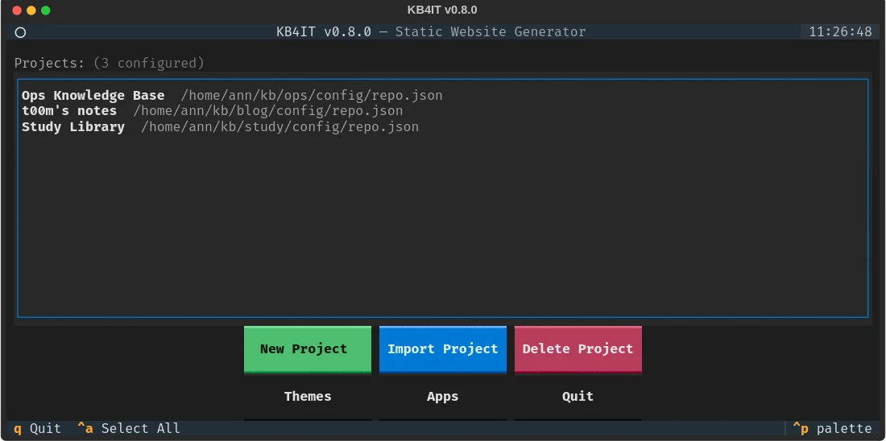
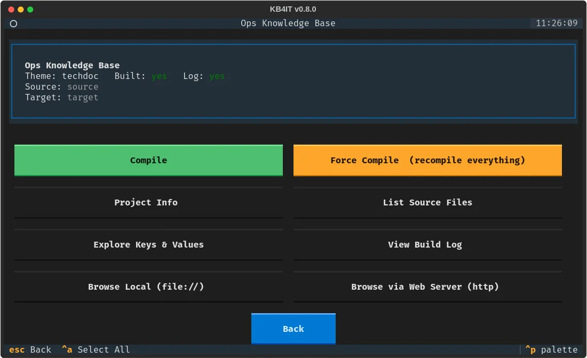
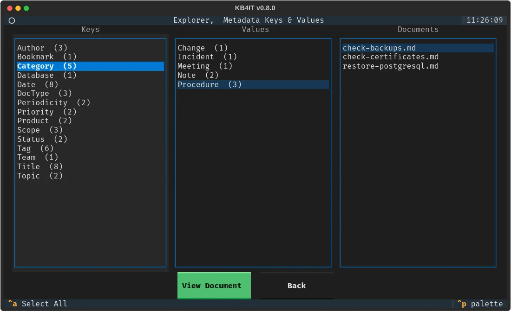

# Use the terminal interface

Run `kb4it` without any command in a terminal and it opens a full-screen interface. Use the mouse or the keyboard: <kbd>Tab</kbd> moves between buttons and <kbd>Enter</kbd> activates them. On the project list, <kbd>q</kbd> quits; inside a project, <kbd>Esc</kbd> goes back to the list.

## Add a project {#add}

The main screen lists your projects. Knowledge bases made with `kb4it create`, here or on the command line, are added automatically.

- **New Project** creates a knowledge base: choose a theme and a sample app, type a display name and the folder to create. The parent folder must exist.
- **Import Project** adds one you already have: type the path of its `config/repo.json` and press <kbd>Enter</kbd> to preview it, then **Import**.
- **Delete Project** removes the selected project from the list. The files on disk stay.

## Work on a project {#project}

Select a project and press <kbd>Enter</kbd>.

| Button | Does |
|---|---|
| **Compile** | Builds the site; only what changed |
| **Force Compile** | Rebuilds everything, like `--force` |
| **Project Info** | Shows the settings in `repo.json` |
| **List Source Files** | Lists the documents with their size |
| **Explore Keys & Values** | Browses the properties, see below |
| **View Build Log** | Shows the last log, filtered by level |
| **Browse Local** | Opens the site from disk in your browser |
| **Browse via Web Server** | Serves the site on `http://127.0.0.1` and opens it |

The build screen shows a progress bar and the log as it happens. It says **Done** or **FAILED** at the end; **Copy Log** puts the log on the clipboard.

## Explore your properties {#explore}

**Explore Keys & Values** shows every property, its values and the documents that have each value. Pick a document and press **View Document** to read its properties and text.

It works after the first build, because it reads the index the build writes.

## Other screens {#other}

**Themes** lists the installed themes, and **Apps** the sample apps each theme can create.

!!! tip
    The web server picks a free port from 8642 up and keeps running until you quit, so you can rebuild and reload the browser.
