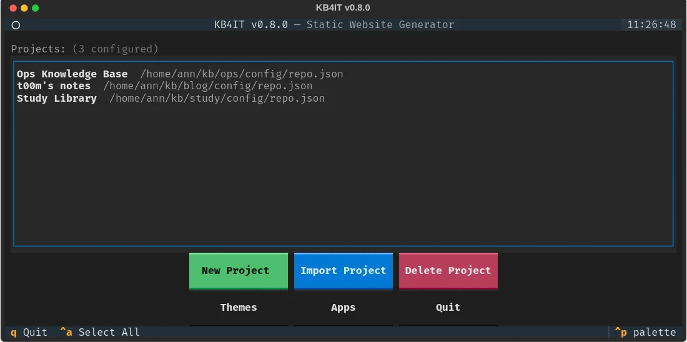
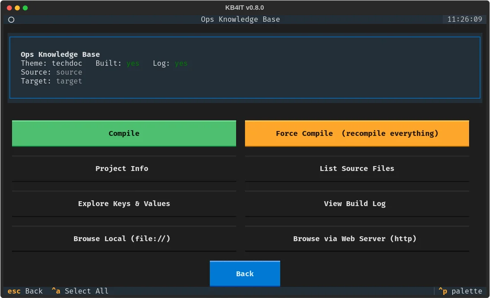
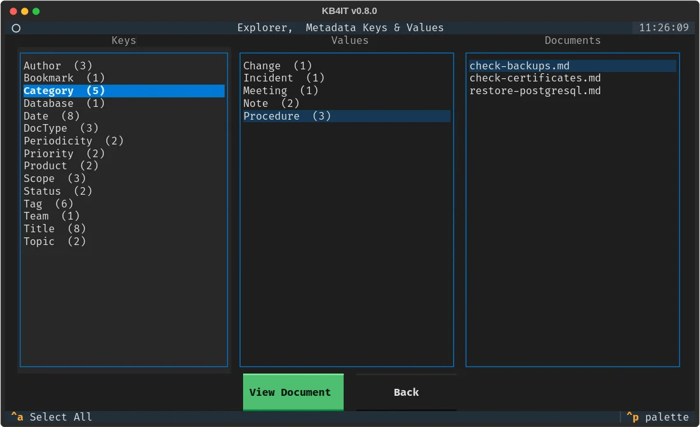

# Use the terminal interface

Run `kb4it` without any command in a terminal and it opens a full-screen interface. Use the mouse or the keyboard: <kbd>Tab</kbd> moves between buttons and <kbd>Enter</kbd> activates them. On the project list, <kbd>q</kbd> quits; inside a project, <kbd>Esc</kbd> goes back to the list. The main screen shows the help banner until <kbd>d</kbd> dismisses it. Drag the mouse over any text, the logs and tables included, to select it; <kbd>Ctrl</kbd>+<kbd>A</kbd> selects the text of the focused part and <kbd>Ctrl</kbd>+<kbd>C</kbd> copies it.

## Add a project {#add}

The main screen lists your projects. Knowledge bases made with `kb4it create`, here or on the command line, are added automatically.

- **New Project** creates a knowledge base: choose a theme and a sample app, type a display name and the folder to create, and answer **Allow search engines** with Yes or No. The parent folder must exist, and nothing is created until you answer. The answer goes into `repo.json` as `seo.index`, like `kb4it create --index`; see [Search engines](reference-repo-json.md#indexing).
- **Import Project** adds one you already have: type the path of its `config/repo.json` and press <kbd>Enter</kbd> to preview it, then **Import**.
- **Delete Project** removes the selected project from the list. The files on disk stay.

## Work on a project {#project}

Select a project and press <kbd>Enter</kbd>.

| Button | Does |
|---|---|
| **Compile** | Builds the site; only what changed |
| **Force Compile** | Rebuilds everything, like `--force` |
| **Project Info** | Shows the settings in `repo.json` |
| **List Source Files** | Lists the documents with their size |
| **Explore Keys & Values** | Browses the properties, see below |
| **View Build Log** | Shows the last log, filtered by level |
| **Settings Reference** | Lists every `repo.json` setting of the project's theme, see below |
| **Edit repo.json** | Edits the project's `repo.json`, saving it only when the check passes, see below |
| **Browse Local** | Opens the site from disk in your browser |
| **Browse via Web Server** | Serves the site on `http://127.0.0.1`, opens it, and rebuilds it when you save a document; open pages reload by themselves |

The build screen shows a progress bar and the log as it happens. It says **Done** or **FAILED** at the end; **Copy Log** puts the log on the clipboard: with `wl-copy`, `xclip` or `xsel` on Linux, `pbcopy` on macOS and `clip.exe` on Windows, or through the terminal when none of them is available.

## Explore your properties {#explore}

**Explore Keys & Values** shows every property, its values and the documents that have each value. Pick a document and press **View Document** to read its properties and text.

It works after the first build, because it reads the index the build writes.

## Change the settings {#settings}

**Settings Reference** lists every `repo.json` setting the project's theme reads: the common ones and the theme's own. Each row shows the key, the value the project sets, the default and where the setting comes from (**Common** or the theme). Settings inside a block use a dotted name, such as `seo.index` or `markdown.highlight`; `profiles.<Property>.type` stands for a setting of each property in the `profiles` block. Bold rows are set in the project. Type in the filter box to find a key or a word of its meaning. The box under the table shows the full meaning, with the values the setting takes. The list comes from this help: [Repository settings](reference-repo-json.md) and the theme's reference page. A theme without a reference page shows the common settings only.

**Edit repo.json** opens the file in a small text editor.

1. Change the text.
2. Press **Check** or <kbd>F5</kbd>. The check reads the file the way a build does: valid JSON, the four required keys, a theme the build can find, the source and target folders, the hooks file, and the `editor`, `markdown`, `site_url`, `overrides`, `seo`, `profiles` and `dates` settings. It lists every problem it finds. It does not run the hooks file.
3. When the check passes, press **Save** or <kbd>Ctrl</kbd>+<kbd>S</kbd>. Save stays off until a check passes, and any edit after the check turns it off again.

**Revert** goes back to the file on disk. Leaving with unsaved changes asks first. The file is saved as you typed it, with your spacing and key order; the next build uses it.

## Other screens {#other}

**Themes** lists the installed themes, and **Apps** the sample apps each theme can create.

!!! tip
    The web server picks a free port from 8642 up and keeps running until you quit. It watches the knowledge base like [`kb4it serve`](howto-preview.md): after each save it rebuilds, shows a notification and reloads the page. **Compile** still works while it runs.
