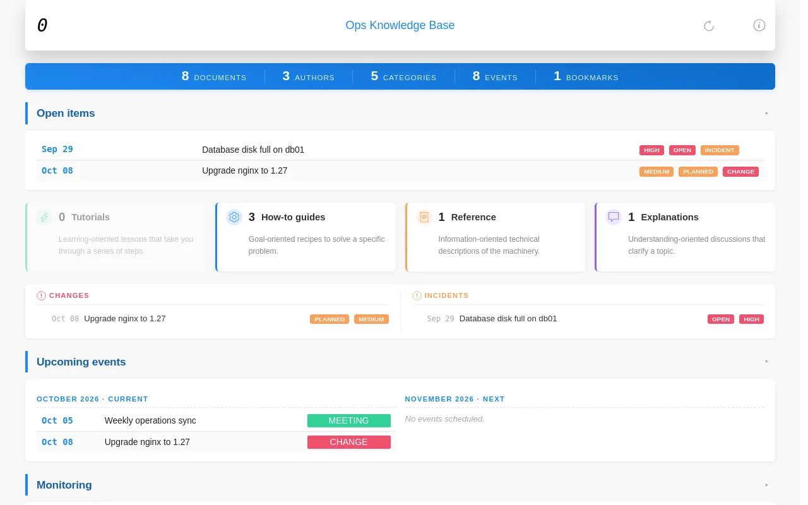

# KB4IT Help

<section class="ah-hero">
  
Write plain Markdown files. KB4IT turns them into a fast, static website you can browse by author, category, tag or any other property you use.

  <form class="ah-hero-search" action="search.html" role="search">
    <input name="q" type="search" placeholder="Search the help" aria-label="Search">
    <button type="submit">Search</button>
  </form>
</section>

New here? [Get started with KB4IT](getting-started.md) takes ten minutes, from installing it to your first website.

## What do you want to do?

  <section class="ah-card">
    
<strong>Start</strong>

    <ul class="ah-list">
      <li><a href="getting-started.html">Build your first website</a> Install, create, write, build, open.</li>
      <li><a href="howto-install.html">Install or upgrade KB4IT</a> With uv, pipx, pip or from source.</li>
      <li><a href="explanation-how-it-works.html">How KB4IT works</a> Files in, website out, and why it is fast.</li>
    </ul>
  </section>
  <section class="ah-card">
    
<strong>Write</strong>

    <ul class="ah-list">
      <li><a href="howto-write-documents.html">Write a document</a> Properties, title, sections, links, notes and images.</li>
      <li><a href="explanation-properties.html">How properties become navigation</a> Every property you use gets its own pages.</li>
      <li><a href="reference-document-format.html">Document format</a> The exact rules a document must follow.</li>
    </ul>
  </section>
  <section class="ah-card">
    
<strong>Build and publish</strong>

    <ul class="ah-list">
      <li><a href="howto-build.html">Build and rebuild a website</a> Fast rebuilds, full rebuilds and checks.</li>
      <li><a href="howto-use-tui.html">Use the terminal interface</a> Manage, build and browse projects from one screen.</li>
      <li><a href="howto-publish-github-pages.html">Publish on GitHub Pages</a> Build and publish on every push.</li>
      <li><a href="howto-publish-web-server.html">Publish on any web server</a> Copy one folder; no server software needed.</li>
    </ul>
  </section>
  <section class="ah-card">
    
<strong>Choose a look</strong>

    <ul class="ah-list">
      <li><a href="explanation-themes.html">Themes</a> Pick the theme that fits what you write.</li>
      <li><a href="reference-theme-techdoc.html">techdoc</a>, <a href="reference-theme-blog.html">blog</a>, <a href="reference-theme-bookshelf.html">bookshelf</a>, <a href="reference-theme-apphelp.html">apphelp</a> What each bundled theme offers.</li>
      <li><a href="howto-create-theme.html">Create your own theme</a> Templates, logic and where to install it.</li>
    </ul>
  </section>
  <section class="ah-card">
    
<strong>Look something up</strong>

    <ul class="ah-list">
      <li><a href="reference-command-line.html">Command line</a> Every command and option.</li>
      <li><a href="reference-repo-json.html">Repository settings</a> Every key of <code>repo.json</code>.</li>
      <li><a href="troubleshooting.html">Troubleshooting</a>, <a href="faq.html">questions</a> and <a href="tips.html">tips</a> When something does not look right.</li>
    </ul>
  </section>
  <section class="ah-card">
    
<strong>Develop KB4IT</strong>

    <ul class="ah-list">
      <li><a href="dev-architecture.html">How KB4IT is built</a> Services, build stages and the cache.</li>
      <li><a href="dev-setup.html">Run and test from source</a> Clone, test and check the themes.</li>
      <li><a href="dev-release.html">Release a version</a> and <a href="dev-help.html">write these pages</a> For maintainers.</li>
    </ul>
  </section>

Browse every page by feature in **Topics**, or use the search box at the top.

## What you get {#preview}

The same Markdown files, built with the techdoc theme:

