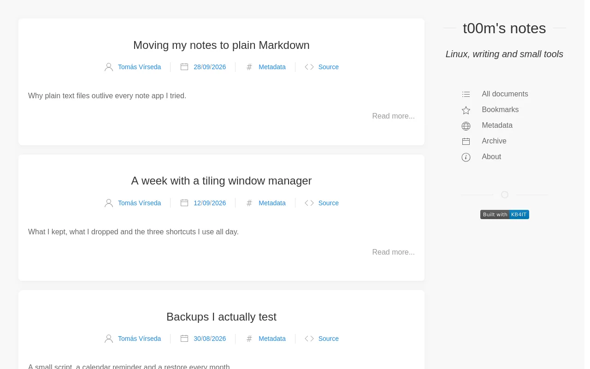

# blog

blog publishes your documents as posts, newest first, with an excerpt on the home page and an archive by date.



## Write a post {#post}

```markdown
---
Author: Tomás Vírseda
Category: Post
Date: 2026-09-28
Tag: markdown, notes
---

# Moving my notes to plain Markdown

## Excerpt

Why plain text files outlive every note app I tried.

## Body

The full text...
```

- The home page shows the text of the `## Excerpt` section and a **Read more** link. A post without one shows "Excerpt missing".
- `Date` orders the posts and places them in the archive.
- The author and date are shown under the title when the post has them.

## Pages {#pages}

| Page | Shows |
|---|---|
| `index.html` | The newest posts with their excerpts |
| `events.html` | The archive, by year and month |
| `all.html` | Every document in a table |
| `bookmarks.html` | Documents with `Bookmark: Yes` |
| `properties.html` | Every property and its values |
| `stats.html` | A tag cloud of the values |

## Settings {#settings}

| Key | Default | Meaning |
|---|---|---|
| `index_posts` | `10` | Number of posts on the home page |
| `strict` | `false` | When `true`, only `Category: Post` documents use the post layout; other documents use a plain page |
| `datatable` | | Columns of the document tables; the `default` app uses Date, Title and Topic |
| `git`, `git_server`, `git_user`, `git_repo`, `git_branch`, `git_path` | | Edit links; `git_server` is a full URL such as `https://github.com` |

See also the [common settings](reference-repo-json.md).
