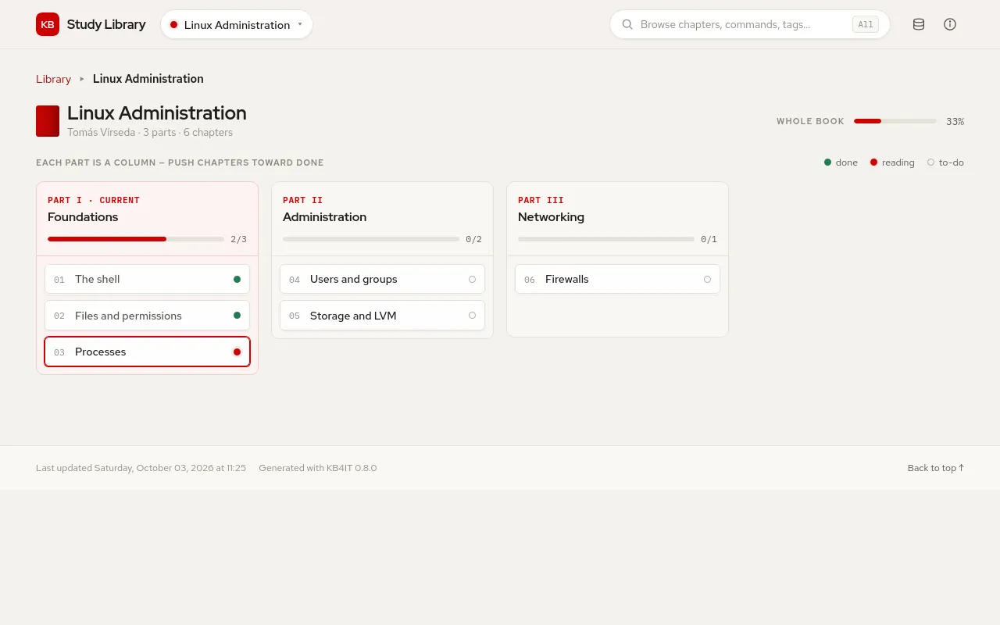

# bookshelf

bookshelf arranges your notes as books on a shelf. Each document is a chapter; the theme tracks what you have read and takes you back to where you stopped.


## Write a chapter {#chapter}

```markdown
---
Book: Linux Administration
Part: II
PartTitle: Administration
Chapter: 5
Status: Reading
Command: lvcreate, vgextend
---

# Storage and LVM
```

| Property | Meaning |
|---|---|
| `Book` | The book the chapter belongs to; chapters without one go to **Unfiled** |
| `Part` | Part number, in Roman (`II`) or Arabic (`2`) numerals |
| `PartTitle` | Name of the part, shown in the book overview |
| `Chapter` | Chapter number; `5` and `Chapter 5` both work |
| `Status` | Reading progress, see below |
| `Command` | Commands the chapter teaches; they get their own pages |

Chapters are ordered by part, then by chapter number.

## Reading progress {#status}

| `Status` | Counts as |
|---|---|
| `Done`, `Completed`, `Complete`, `Published`, `Closed`, `Final` | done |
| `Reading`, `In progress`, `Review`, `WIP`, `Ongoing` | reading |
| anything else, or none | to do |

Case does not matter. The shelf shows the progress of each book, and **Continue where you left off** opens the first chapter marked as reading; without one, the latest chapter that is not done.

## Pages {#pages}



| Page | Shows |
|---|---|
| `index.html` | The shelf, the chapter to continue and totals; your own `index.md` replaces it |
| `Book_<name>.html` | The book overview: one column per part, one card per chapter |
| Chapter pages | Navigation through the part, previous and next chapter, commands and tags |
| `all.html`, `bookmarks.html`, `properties.html`, `stats.html` | As in the other themes |

## Settings {#settings}

| Key | Default | Meaning |
|---|---|---|
| `datatable` | `["Date", "Title", "Chapter"]` | Columns of the document tables |
| `git`, `git_server`, `git_user`, `git_repo`, `git_branch`, `git_path` | | Edit links; `git_server` is a full URL such as `https://github.com` |

See also the [common settings](reference-repo-json.md).
