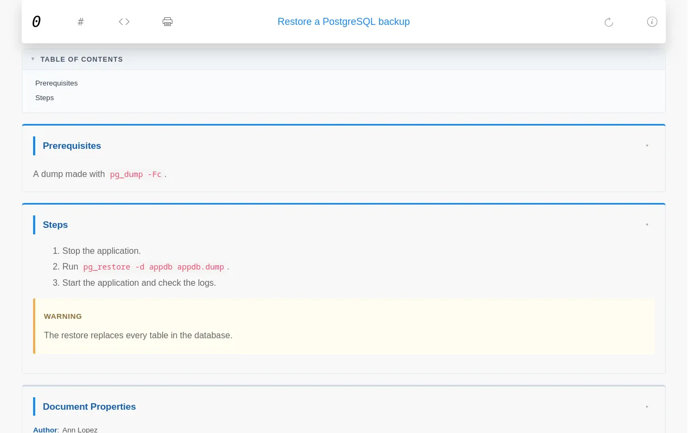

# techdoc

techdoc turns a folder of runbooks, incident reports, changes and notes into a team knowledge base with a dashboard.

## Properties it reacts to {#properties}

| Property | Values | Effect |
|---|---|---|
| `Category` | `Change`, `Incident`, `Meeting`, `Note`, `Post`, `Procedure`, `Report`, `Task` | Groups documents; dated documents of the categories in `events` appear in the calendar |
| `DocType` | `Tutorial`, `How-to guide`, `Reference`, `Explanation` | Counted in the four cards of the dashboard |
| `Priority` | `Critical`, `Very high`, `High`, `Medium`, `Normal`, `Low`, `Unknown` | Coloured label; open items are sorted by it |
| `Status` | Open: `New`, `Open`, `Draft`, `Planned`. Closed: `Completed`, `Finished`, `Released`, `Successful`. Faded: `Deprecated`, `Obsolete` | Coloured label; open values put incidents, changes and tasks under **Open items** |
| `Topic` + `Periodicity` | `Topic: Monitoring` with `Periodicity: Daily`, `Weekly`, ... | Listed in the **Monitoring** panel by periodicity |
| `Bookmark` | `Yes` | Listed on the **Bookmarks** page |
| `Date` | any [date](reference-document-format.md#dates) | Sorting, calendar, upcoming and recent events |

Any other property gets its own pages, as in every theme.

## Dashboard {#dashboard}

The home page shows, from top to bottom:

- Counts of documents, authors, categories, events and bookmarks.
- **Open items**: incidents, changes and tasks with an open status, highest priority first.
- The four types of document, with counts.
- The latest changes and incidents.
- **Upcoming events** for this month and the next, and recent events from the last month.
- **Monitoring**: recurring checks grouped by periodicity.

## Document pages {#document}

Each document gets a table of contents, sections that fold when you click their title, its properties at the end, and buttons to show the Markdown source and to print. With `"git": true`, an edit button opens the file in your git server.

## Other pages {#pages}

| Page | Shows |
|---|---|
| `all.html` | Every document in a sortable, searchable table |
| `events.html` | A calendar per year and a table of events |
| `properties.html` | Every property and its values |
| `stats.html` | Counts and a word cloud of the values |
| `bookmarks.html` | Documents with `Bookmark: Yes` |
| `add.html` | A form that fills a ready-made skeleton per category, to copy into a new file |
| `help.html` | A short guide to writing documents |

## Settings {#settings}

Keys in `repo.json` that techdoc reads, on top of the [common ones](reference-repo-json.md):

| Key | Default | Meaning |
|---|---|---|
| `datatable` | `["Date", "Title"]` | Columns of the document tables |
| `events` | `[]` | Categories that count as events |
| `admin` | `false` | Builds the backup page, see below |
| `git`, `git_server`, `git_user`, `git_repo`, `git_branch`, `git_path` | | Edit links; `git_server` is a full URL such as `https://github.com` |

The `default` app sets `datatable` to Date, Title, Category, Priority, Status, Scope and Topic, and lists every category in `events`.

## Backups page {#admin}

With `"admin": true`, every build writes `target/admin/index.html` with two downloads:

| File | Holds |
|---|---|
| `<title>_sources.zip` | Every `.md` file of `source/` |
| `<title>_site.zip` | The whole website, without the admin folder |

The zips are rebuilt only when something changed. The page is not linked from the menu, but anyone who knows the address can open it: on a public server, protect `admin/` or leave this off.

## Sample apps {#apps}

| App | Starts you with |
|---|---|
| `default` | An empty knowledge base with the settings above |
| `sapbasis` | The same, prepared for SAP Basis documentation |
