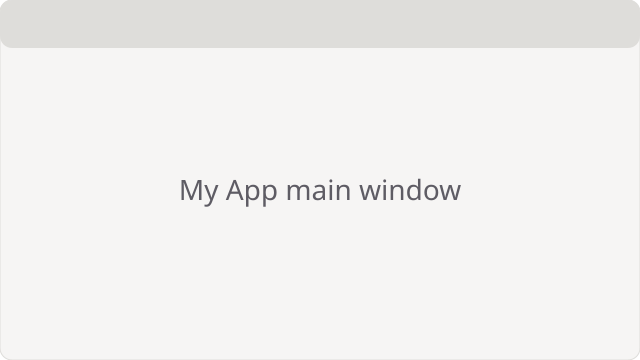

# Get started with My App

!!! note "What you need"
    A computer with Linux or Windows and ten minutes.

## Install My App {#install}

Install My App from your software centre, or as a Flatpak.

## Create a repository {#create-repository}

Open My App and choose **New repository**. Pick an empty folder.

## Add a document {#add-document}

Drag a file onto the window. To change its name later, see [Rename a document](howto-rename-document.md#rename).
